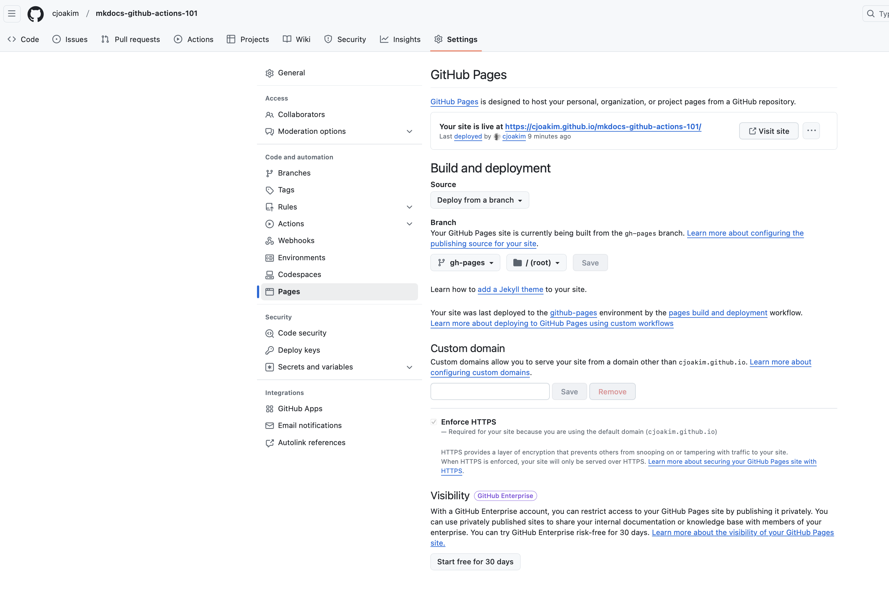

# mkdocs-github-actions-101

Repo for learning MkDocs, GitHub Pages, and GitHub Actions 

See corresponding GitHub Pages site https://cjoakim.github.io/mkdocs-github-actions-101/

---

## Lessons Learned and Quick Start

- Configure **GitHub Actions** with yml files in the .github/workflows directory
  - See example workflow1.yml
  - Wokflows can be triggered by events (i.e. - push events)
  - Wokflows can be triggered manually from the GitHub UI (i.e. - workflow_dispatch)

- Configure **mkdocs** with the mkdocs.yml file in the repo root directory
  - mkdocs uses the /docs directory as the default source
  - mkdocs uses the /site directory as the default output build location
    - the /site directory should be git-ignored
  - mkdocs is a python library
    - https://pypi.org/project/mkdocs/
    - create a minimal python virtual environment in the repo root directory
    - see mkdocs_venv.ps1 and mkdocs_venv.ps1
    - execute the mkdocs_venv.* script for your OS (Win or mac/linux)
    - activate the python virtual environment
  - run "mkdocs build" to build the pretty html/css docs into the /site directory
  - run "mkdocs serve" to run a local http server
    - visit http://127.0.0.1:8000/ with your web browser to see/preview the docs
    - these docs are served locally from the git-ignored /site directory
  - deploy the docs to **GitHub Pages** with the following command
    - mkdocs gh-deploy
    - this builds the /site dir to the / (i.e. - root) dir of the the gh-pages branch
    - See site **https://cjoakim.github.io/mkdocs-github-actions-101/**
      - Format of Pages URL is https://<owner>.github.io/<repo-name>/

- **Configure GitHub Pages** for the repo
  - Repo --> Settings --> Pages
    - for source, choose branch --> gh-pages, directory --> / (root; not /docs or /site)

- **You DON'T need to use GitHub Actions to build and deploy the GitHub Pages**
  - as described above, build and test the docs locally, then **mkdocs gh-deploy**

---

## Screen Shots

  

GitHub Pages configuration - note the source, branch, and directory.

---

  

List of executed GitHub Actions.

---

  

Detail of an executed GitHub Action.

---

## Links

### GitHub

- https://github.com/features/actions
- https://docs.github.com/en/actions

### Manning Publications

- [Manning Book](https://www.manning.com/books/github-actions-in-action)
- [Manning Repo](https://github.com/GithubActionsInAction)

### Visual Studio Code

- https://marketplace.visualstudio.com/items?itemName=GitHub.vscode-github-actions

### MkDocs

- https://www.mkdocs.org
- https://www.mkdocs.org/user-guide/deploying-your-docs/ 
- https://pypi.org/project/mkdocs/

