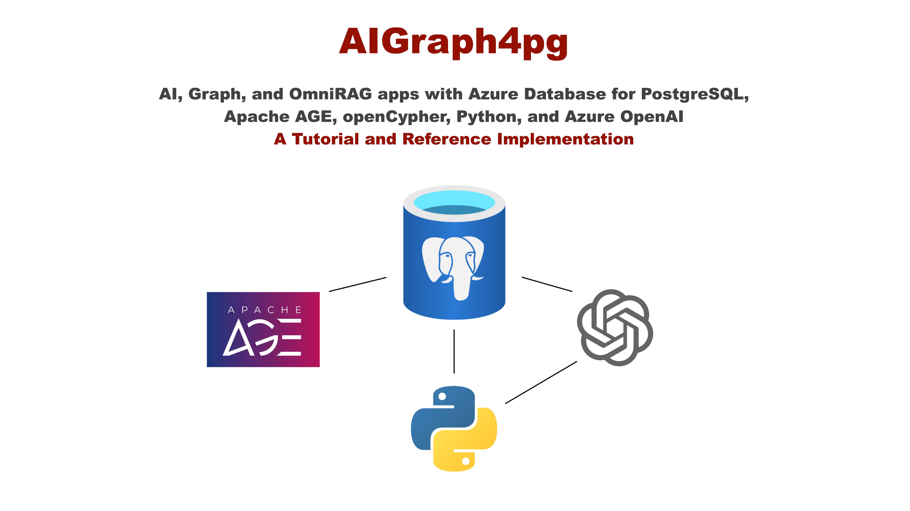
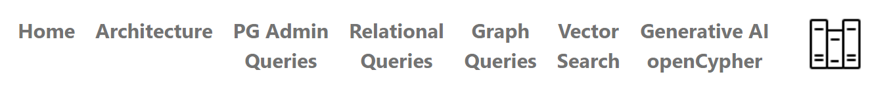
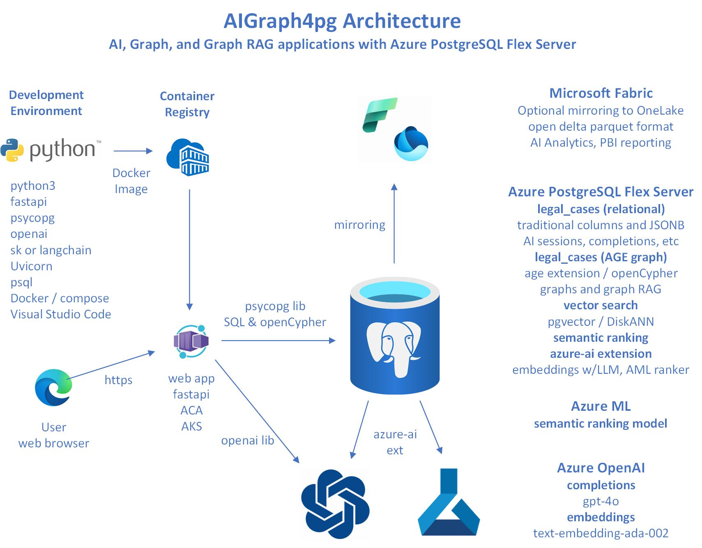

# Introduction

<p align="center">
  
</p>

**AIGraph4pg** is a tutorial and reference application, implemented with
**Azure Database for PostgreSQL**, for both Graph and AI use-cases.
It is an open-source project that customers can learn from, and
possibly model their projects based on the provided codebase.

This reference application demonstrates the use of several PostgreSQL
extensions including **Apache AGE**, **pgvector**, and **azure_ai**
to implement the graph and AI functionality.
Apache AGE uses the **openCypher** graph query language, similar to Neo4j.

**Azure OpenAI** is used in this application for embeddings generation
for vector search, as well as for generative-AI of openCypher queries.

This GitHub repository application contains a **curated dataset** of USA Legal Cases
primarily in Washington state.  The dataset nicely demonstrates vector search
functionality (i.e. - case descriptions) as well as graph use cases (i.e. - case citations).
This dataset is **pre-vectorized** as the necessary embeddings have already
been created by invoking Azure OpenAI.

The curated dataset is used to load one relational table named **legal_cases**,
which contains both embeddings/vector data as well as interesting JSONB data.
The dataset also contains a zipped file that can be used to load the corresponding
Apache AGE graph, also named "legal_cases".

This application is implemented in **Python**, and also uses the **psql**
command-line tool.  Users of this application are expected to have some
familiarity with these tools, and have them **installed** in on their 
Windows 11 or macOS workstations/laptops.  Setup and use of these are
described elsewhere in the docs.

This reference application uses your instance of **Azure Database for PostgreSQL**,
and includes a web application UI that is intended to run on your 
**workstation or laptop**.  The web app can be executed locally either as a
Python process or as a public Docker image available on DockerHub.
Some **console app** functionality is also available in Python file main.py.

Each page in the web application demonstrates specific topics (i.e. -
Administrative queries, SQL queries, SQL JSONB queries, Graph queries,
Vector Search, etc.).  Each page contains a Library icon that can be clicked
to display **context-sensitive tutorial content** on that topic.
You can then click the Library icon again to return to the functional
non-tutorial page.

These topics are presented in a **left-to-right** manner in the Top Navigation
area of each page, with each topic building on the previous page.

The following image shows this **Top Navigation UI**, along with the Library icon.

<p align="center">
  
</p>

---

## Architecture

<p align="center">
  
</p>

---

## Documentation Links

This reference implemention is primarily built upon the Azure PaaS services
and open-source software listed below:

* [Azure Database for PostgreSQL - Flexible Server](https://learn.microsoft.com/en-us/azure/postgresql/)
* [Apache AGE Graph Database](https://age.apache.org/)
* [openCypher language](https://opencypher.org/)
* [Azure OpenAI](https://learn.microsoft.com/en-us/azure/ai-services/openai/)
* [Python](https://www.python.org/)
  and software libraries hosted a the
  [The Python Package Index (PyPI)](https://pypi.org/)

---

## Next Steps

The context-sensitive **tutorial content** is embedded into the
web application that runs locally on your workstation/laptop.
See it by clicking the books icon on the Top-Nav.

The [Frequently Asked Questions (FAQ)](faq.md) page may
answer some of your questions about Azure PostgreSQL
and this reference application.

---

## Directory Structure of this GitHub Repository

```
Directory/File             Description

├── az                     az CLI deployment script for Azure PostgreSQL
├── data
│   └── legal_cases        Zipped curated dataset files for both relational and graph data
├── docs                   User documentation
└── python                 The Python-based implementation
    ├── config             Contains file sample_queries.txt, used by the Web UI
    ├── sql                Miscellaneous SQL, DDL, indexing scripts
    ├── src                The primary Python source code
    ├── static             Static assets used in the Web app
    ├── templates          Jinja2 templates used in text generation
    ├── tests              Unit tests
    ├── views              Web app HTML views/templates, including tutorial_<topic>.html pages
    ├── main.py            The "console app" part of this application
    ├── requirements.in    The base list of Python requirements, used by venv.ps1/venv.sh
    ├── venv.ps1           Windows PowerShell script to create the Python virtual environment
    ├── venv.sh            Linux/macOS script to create the Python virtual environment
    ├── webapp.py          The Web application, built with the FastAPI framework
    ├── webapp.ps1         Windows PowerShell script to start the Web app
    └── webapp.sh          Linux/macOS script to start the Web app
```
