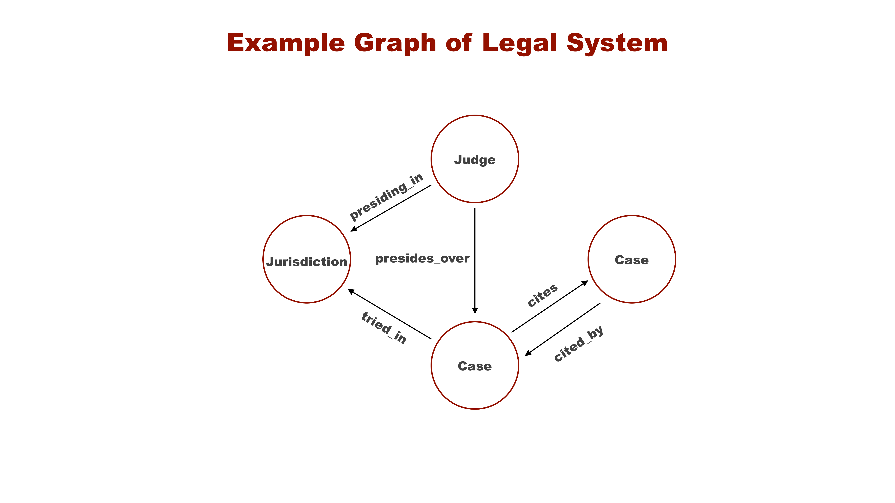

## AIGraph4pg Tutorial : Graphs, Apache AGE, and openCypher

---

##### Graph Terminology

There are several types of **graph databases**.
One of the most common is called **Labeled Property Graph** or
**LPG**.With LPG graphs, you compose the graph of **nodes** and **edges**.**Nodes represent the entities** in the graph, and the
**Edges represent the relationships** between the nodes or entities.
Nodes are alternatively called **Vertices**.
Nodes and Edges can have an arbitrary set of **properties** which are key-value data pairs.These relationships or edges are "first class citizens" within graph databases,
and the relationships are often more important than the nodes themselves.
While relational databases offer foreign key constraints, the edges
in a graph database are more nuanced and expressive.

Definitions:

* **Graph** : A collection of nodes and edges
* **Node** : An entity or vertex in a graph
* **Edge** : A named connection between two nodes
* **Property** : Key-value pair associated with a node or edge
* **Label** : A tag attached to a node or edge, such as "Case" in the following diagram



In the above visualization, the Nodes are represented as named **circles**
while the Edges are represented as named **lines**.The edges are **directed** and don't imply or require a
reverse relationship. For example, in this model, there is a
**Case -> tried\_in -> Jurisdiction** relationship
but no corresponding relationship from Jurisdiction to Case.With LGP graphs there is no explicit **schema** that you have to define.
The schema is implicitly created as you add your Nodes and Edges.Note that the graph implemented in this reference application only
contains **Case Nodes and cites and cited\_by Edges**.
Note Judges, Jurisdictions, and other edge types.

---

##### openCypher

[openCypher](https://opencypher.org) is the query language
used by Apache AGE.
Per the opencypher.org website:  

openCypher is an open source specification of Cypher® - the most widely adopted
query language for property graph databases. Cypher was developed by Neo4j®.
The openCypher syntax is well documented
[here](https://s3.amazonaws.com/artifacts.opencypher.org/openCypher9.pdf)
in a 200+ page PDF document. It is recommended that you download this PDF and keep it
as a handy reference.The following is an example openCypher to find a specific Case node:
```

  MATCH (c:Case {id:594079}) RETURN c
  
```
In this example, "Case" is the type of Node, and we're searching for the Case
with the "id" property equal to 594079. The "c:" part indicates that we're
assigning the Case node to the variable "c", then the query RETURNs the "c" variable.Now, when we execute this same query in Apache AGE, we wrapper the openCypher query
with a SQL query that looks like the following:
```

    select * from ag_catalog.cypher('legal_cases',
      $$ MATCH (c:Case {id:594079}) RETURN c $$)
    as (c agtype);
  
```
This SQL invokes the "cypher" function in the Apache AGE "ag\_catalog" schema,
and provides the name of the graph to be queried (i.e. - "legal\_cases").
The return variable c is cast to the "agtype" data type of Apache AGE,
which is its' standard return type.
```

    select * from ag_catalog.cypher('legal_cases',
      $$ MATCH (c:Case {id:594079}) RETURN c $$)
    as (c agtype);
  
```
Before that query is executed, you'll need to add the Apache AGE schema
(i.e. - ag\_catalog) to your schema search path, as shown below in a psql session.
```

    dev=> SET search_path TO public, ag_catalog, legal_cases;
  
```
In this example, the search path is set to the public schema first,
followed by age, followed by your specific graph schema (i.e. - legal\_cases).
See the official PostgreSQL documentation on
[Schemas and the search\_path](https://www.postgresql.org/docs/current/ddl-schemas.html).Alternatively, the **alter user** command can be used to
set the search path for a specific user, as shown below:
```

    dev=> alter user  set search_path='public','ag_catalog';
  
```

---

##### Creating and Loading an AGE Graph

Please revisit the **docs\readme.md page of the GitHub repository**
where this process is documented.This section further explains the process.There are multiple ways to load an Apache AGE graph in Azure PostgreSQL.
One way by using the **psql** command line utility to redirect
in a set of SQL statements that load the Nodes and Edges; this is the approach
used in the docs\readme.md page.The Microsoft Azure PostgreSQL team is currently working on a high-speed data loader utility
for Apache AGE graphs. This will be used and documented in this reference application
once it becomes available.Currently, this reference application loads the graph with this command that invokes psql:
```

    .\pg.ps1 flex dev ..\data\legal_cases\age_load_statments.sql
  
```
The data in file **age\_load\_statments.sql** contains three lines that
look like the following. The first line creates a Case Node, the next line creates
a "cites" edge, and the third libe creates an "cited\_by" edge. These three lines have
been reformatted for readability here.
```

    SELECT * FROM cypher('legal_cases',
      $$ CREATE (:Case { id: 594079, url: 'https://static.case.law/wash/79/cases/0643-01.json', name: 'Martindale Clothing Co. v. Spokane & Eastern Trust Co.', court_id: 9029, court: 'Washington Supreme Court', decision_year: 1914, citation_count: 5 }) $$)
    as (v agtype);
    
    SELECT * FROM cypher('legal_cases',
      $$ MATCH (a:Case), (b:Case) WHERE a.id = 1017660 AND b.id = 594079
         CREATE (a)-[e:cites  {case_id: '1017660',  cited_case_id: '594079',  case_name: 'United Mutual Savings Bank v. Riebli',  cited_case_name: 'Martindale Clothing Co. v. Spokane & Eastern Trust Co.',  cited_case_year: 1914 }]->(b) RETURN e $$)
    as (e agtype);

    SELECT * FROM cypher('legal_cases',
      $$ MATCH (a:Case), (b:Case) WHERE a.id = 594079 AND b.id = 1017660
         CREATE (a)-[e:cited_by  {case_id: '594079',  cited_case_id: '1017660',  case_name: 'Martindale Clothing Co. v. Spokane & Eastern Trust Co.',  cited_case_name: 'United Mutual Savings Bank v. Riebli',  cited_case_year: 1960 }]->(b) RETURN e $$)
      as (e agtype);
  
```
In the first line, notice how the new Case Node contains an arbitrary set of properties
in JSON format. This is schemaless in nature.The next two lines create Edges that are associated with this Case 594079.
Notice how the two Nodes are first located with the **MATCH** clause, and the Edge
is then **CREATEd** between the MATCHed Nodes. Notice that Edges also may be created
with an arbitrary set of properties in JSON format.

---

##### The Underlying Apache AGE Data Structures

You can use the PostgreSQL **pg\_dump** utility, with the **--schema-only**
option to dump the schema of your database to gain insight into how the AGE graph
is stored in the database. The output will be similar to the following:
```

    CREATE TABLE legal_cases._ag_label_vertex (
      id ag_catalog.graphid NOT NULL,
      properties ag_catalog.agtype DEFAULT ag_catalog.agtype_build_map() NOT NULL
    );

    CREATE TABLE legal_cases._ag_label_edge (
      id ag_catalog.graphid NOT NULL,
      start_id ag_catalog.graphid NOT NULL,
      end_id ag_catalog.graphid NOT NULL,
      properties ag_catalog.agtype DEFAULT ag_catalog.agtype_build_map() NOT NULL
    );

    CREATE TABLE legal_cases."Case" ()
    INHERITS (legal_cases._ag_label_vertex);

    CREATE TABLE legal_cases.cited_by ()
    INHERITS (legal_cases._ag_label_edge);

    CREATE TABLE legal_cases.cites ()
    INHERITS (legal_cases._ag_label_edge);
  
```
In this case the name of the graph is "legal\_cases", and it is in its own schema.Apache AGE creates two **superclass tables** for each graph,
one for all Nodes and one for all Edges (i.e. - \_ag\_label\_vertex and \_ag\_label\_edge).Then, AGE uses the **INHERITS** clause to create one table for each Node type
and one table for each and Edge type in your graph.

---

##### Interacting with your AGE graph in Azure PostgreSQL

To execute [CRUD](https://en.wikipedia.org/wiki/Create,_read,_update_and_delete)
operations vs AGE you simply use the tools and software libraries that you already use with PostgreSQL.For example, the **psql** command line utility, the **pgAdmin** GUI,
or a software library like **psycopg2** for Python.See **the post\_query method in webapp.py** in the repo for an example of how
to use psycopg\_pool to interact with AGE in an asynchronous manner.

