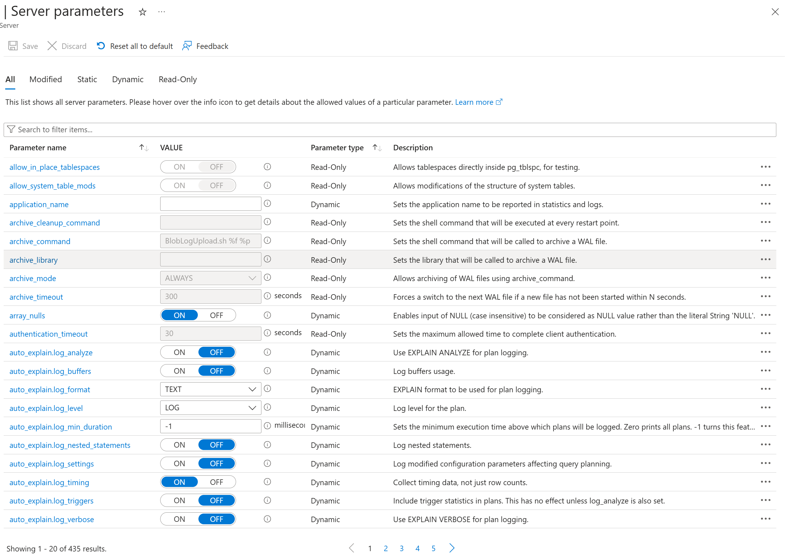

## AIGraph4pg Tutorial : Azure PostgreSQL Administration

##### PostgreSQL Documentation

There is a vast amount of documentation available for PostgreSQL, including:

* [Official documentation in HTML format](https://www.postgresql.org/docs/current/).
* [Official documentation in PDF format](https://www.postgresql.org/docs/).
  The PDF file alone is over 3100 pages long
* [Azure Database for PostgreSQL - Flexible Server documentation](https://learn.microsoft.com/en-us/azure/postgresql/)

This tutorial can't possibly cover the entire breadth and depth of PostgreSQL,
and therefore just focuses on the following topics related to this reference application -
PostgreSQL Settings, PostgreSQL Catalog, and Apache AGE.

---

##### PostgreSQL Settings

PostgreSQL is highly configurable via a large set of **Server Parameters**
and some of these may be optimized for performance tuning.These can be viewed and administered in **Azure Portal** as shown below:



Likewise, these parameters may be queried in a client program
such as psql with the following SQL:
```

    select name, setting, category, short_desc
    from  pg_settings
    order by name;
  
```
This SQL is one of the items in the drop-down list of queries
for the **PG Admin Queries** page of this reference
application, thus you can execute it in the web UI.All of the SQL queries in this reference application UI are defined
in file **python/config/sample\_queries.txt** in this repo.
You can edit and customize this file as necessary for your needs.Azure Database for PostgreSQL offers **automated intelligent tuning**
of these parameters for your workload. This feature is described here:
[Configure intelligent tuning for Azure Database for PostgreSQL](https://learn.microsoft.com/en-us/azure/postgresql/flexible-server/concepts-intelligent-tuning).

---

##### PostgreSQL Catalog

As with the server parameters, the catalog of schemas, tables, indexes, and other objects
is queryable with SQL. A few example queries are shown below:Display the columns in a given relational table (i.e. - legal\_cases):
```

    select  ordinal_position, table_catalog, table_name, column_name, data_type, character_maximum_length
    from  information_schema.columns
    where table_name = 'legal_cases'
    order by ordinal_position;
  
```

---

##### PostgreSQL Extensions

List of Available Extensions:
```

    select name, default_version, installed_version, comment
    from  pg_available_extensions
    where installed_version is null
    order by name;
  
```
List of Installed Extensions:
```

    select oid, extname, extversion
    from  pg_extension
    order by extname, extversion;
  
```

---

##### Apache AGE

List the Apache AGE Graphs:
```

    select graphid, name, namespace
    from  ag_catalog.ag_graph
    order by graphid;
  
```
List the Apache AGE Graph Labels - the Vertex and Edge types:
```

    select name, graph, id, kind, relation, seq_name
    from  ag_catalog.ag_label
    order by name;
  
```

